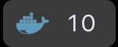
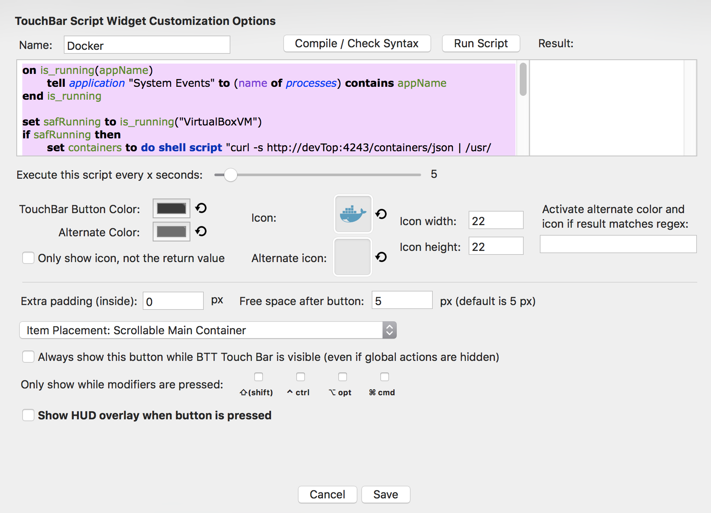

# BetterTouchTool - Docker running container display - Touch Bar

## Description

If you have a MacBook Pro with the touchbar this project will help you to customize your touchbar by :
 - Displaying the number of docker running container
 
Example Full bar (3rd widget) :

Example widget :

## Prerequisite

 - MacBook pro with the Touch Bar
 - Docker install on the Macbook or a virtual machine
 - [Enable the Docker API](https://success.docker.com/article/how-do-i-enable-the-remote-api-for-dockerd) (run docker with the option -H x.x.x.x:port)
 - You can read this article: [Hands-on: Creating a custom Touch Bar button using BetterTouchTool](https://9to5mac.com/2016/12/02/hands-on-custom-touch-bar-button-bettertouchtool-video/)
 - [BetterTouchTool](https://www.boastr.net/downloads/)

## Config

First, you need to add a new widget on the global section. Find the configuration below.

#### Icon

#### Script

For the widget display paste the following script as shared on the previous screenshot.

⚠️ Before saving think about replacing the text *_________YOUR_DOCKER_TCP_ENDPOINT_________* by your docker api endpoint

[Script: Running docker on local](./touchbar.applescript)

[Script: Running docker in a virtual machine touchbar-virtualbox.applescript](./touchbar.applescript)

And Voila !

### Other widget available on github

- [Spotify](https://github.com/olivierodo/MBP-BTT-spotify-touchbar)
- [Clipboard](https://github.com/olivierodo/MBP-BTT-clipboard-touchbar)
- [Wifi](https://github.com/olivierodo/MBP-BTT-wifi-touchbar)
- [Activity Monitor](https://github.com/olivierodo/MBP-BTT-activity-monitor-touchbar)
- [Volume](https://github.com/olivierodo/MBP-BTT-volume-touchbar)
- [Docker](https://github.com/olivierodo/MBP-BTT-docker-touchbar)
